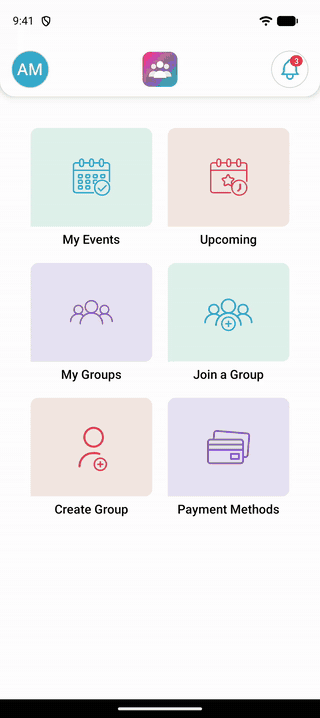
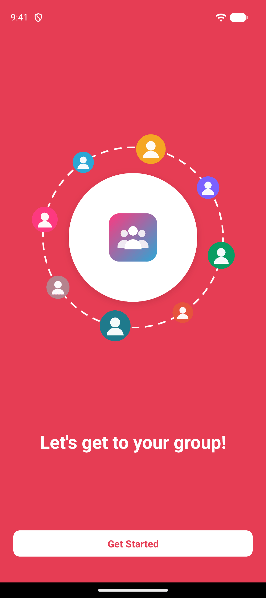
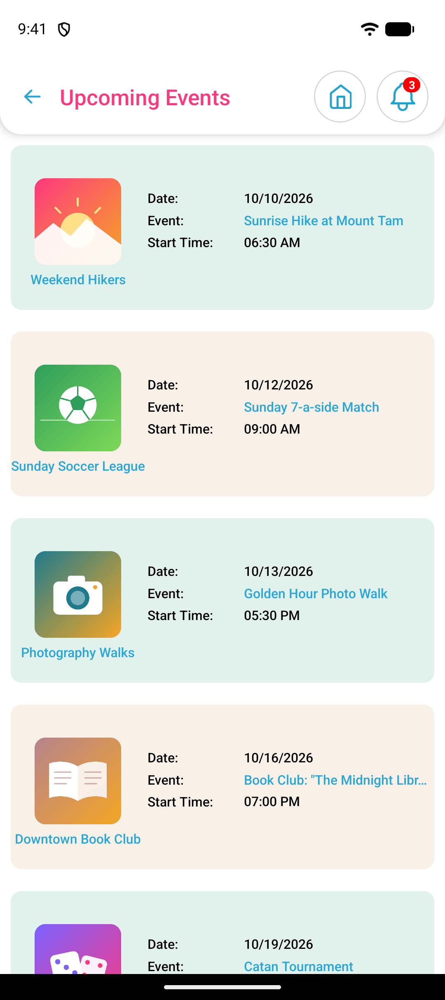
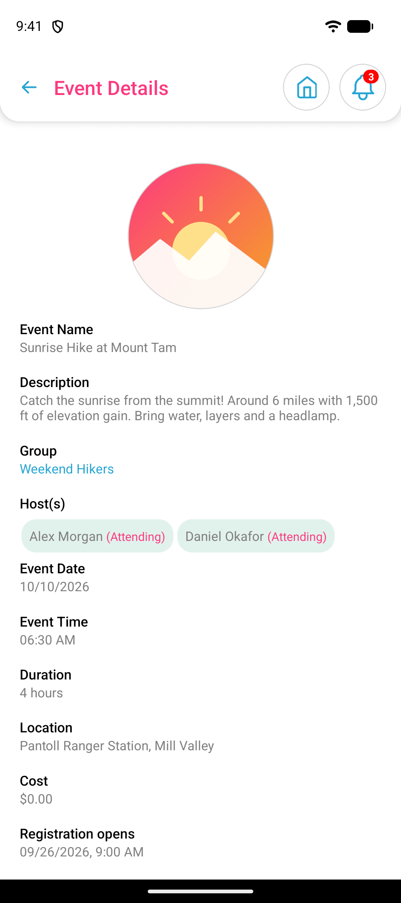
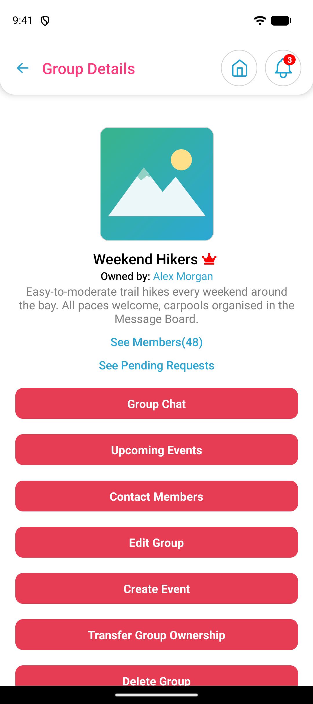
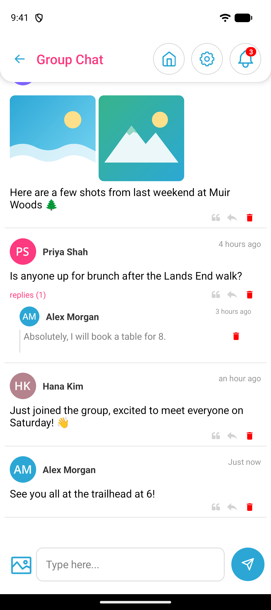
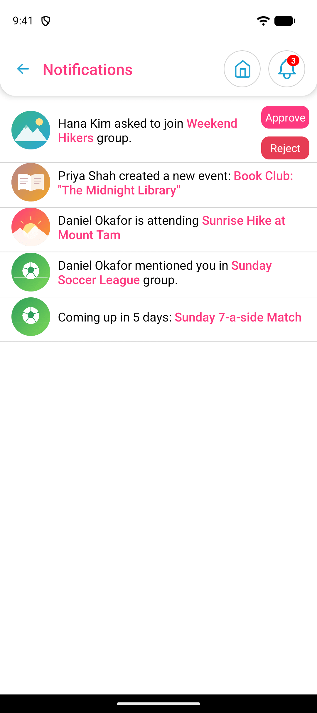
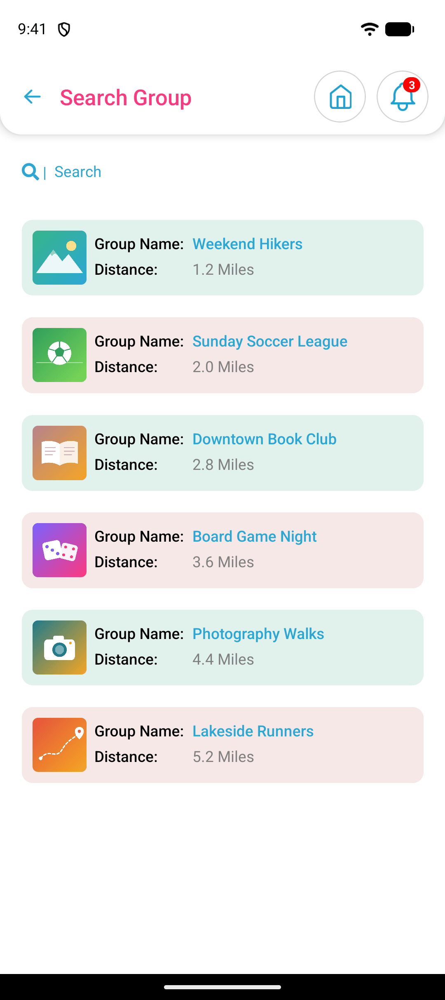
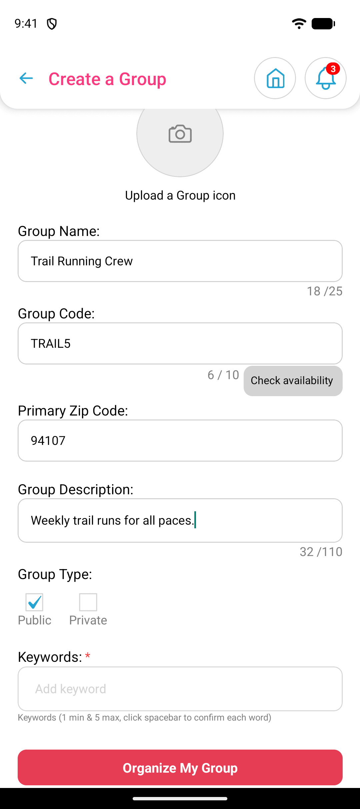

# Organize My Group

A React Native app for people who run groups: hiking clubs, sports leagues,
book clubs, that kind of thing. You create a group (public, or private with a
join code), schedule events for it, and the app handles sign-ups, attendee
limits, guests, entry fees and refunds. Each group also gets its own message
board with replies, quotes, @mentions and photo attachments.

<p align="center">
  
</p>

A longer walkthrough is in [docs/demo.mp4](docs/demo.mp4).

> The logo, icons and photos in this repo are placeholders, and every person,
> group and event in the screenshots is made up. The screenshots were taken
> against the mock API that ships with the project (see below), not a real
> backend.

## Screenshots

| | | |
|:-:|:-:|:-:|
|  |  |  |
| Welcome | Dashboard | Upcoming events |
|  |  |  |
| Event details | Group details | Group chat |
|  |  |  |
| Notifications | Finding a group | Creating a group |

More screens (login, profile, payment methods, my events and so on) are in
[docs/screenshots](docs/screenshots).

## What it does

- **Groups**: create public or private groups, join with a code or by
  searching nearby public groups, approve or decline join requests, hand
  ownership over to another member.
- **Events**: one-off events with a date, time, location, min/max attendance,
  guest limits, entry fee and refund policy. Templates make recurring events
  quicker to set up. Members can register, bring guests or withdraw.
- **Message board**: one per group. Supports replies, quoting, @mentions,
  image attachments and stickers. New posts are picked up every few seconds.
- **Payments**: card payments and payouts through Stripe. Group owners
  connect a Stripe account to receive entry fees.
- **Notifications**: push notifications through Firebase Cloud Messaging,
  plus an in-app list where owners can approve join requests directly.
- **Sign in**: email and password, Google, and Sign in with Apple.

## Tech stack

- React Native 0.74 (Hermes)
- Redux Toolkit with redux-persist for state
- React Navigation 6 (a drawer with nested stacks)
- Reanimated 3 for the small animations
- Firebase: Cloud Messaging, Analytics and Crashlytics
- Axios for the REST API
- Jest for tests

## Getting started

You'll need Node 18 or newer, JDK 17 and the Android SDK. For iOS you also
need Xcode and CocoaPods. Android is what we test on day to day; the iOS
project is there but hasn't been built in a while, so expect some work.

```sh
git clone <this repo>
cd <repo folder>
npm install
```

The project needs two files that aren't in the repo because they hold keys:

1. **Firebase config.** Copy `android/app/google-services.example.json` to
   `android/app/google-services.json`. For the mock API the placeholder values
   are fine, so the build goes through. Push notifications only work with a
   real config from your own Firebase project.
2. **API credentials.** Put your OAuth client ID and secret in
   `src/constants/configs.js`. Again, not needed for the mock API.

Then start Metro and the app:

```sh
npm start
npm run android
```

## Running without a backend

There's a small mock server in [mock-api](mock-api) that serves fake groups,
events, members, chat posts and notifications. It has no dependencies.

```sh
npm run mock-api                  # listens on http://localhost:4000
adb reverse tcp:4000 tcp:4000     # let the emulator reach it
```

Then set `USE_MOCK_API = true` in `src/constants/endpoints.js` and log in
with any email and password. Event dates are generated relative to today, so
the upcoming list never goes stale. [mock-api/README.md](mock-api/README.md)
lists which endpoints are covered.

## Project layout

```
App.js                 navigation setup (drawer + stacks)
src/screens/           one file per screen
src/components/        shared UI (headers, modals, payment sheet, ...)
src/redux/slices/      one slice per API call, built with createAsyncThunk
src/constants/         API endpoints, config, small helpers
mock-api/              local fake backend for development and demos
docs/                  screenshots and demo video
```

## Tests

```sh
npm test
```

Right now this is mostly a smoke test that renders the whole app with the
native modules mocked out (see `jest.setup.js`). It catches broken imports
and crashes on start-up, not much more. Adding tests for the slices is on
the list.

## Known issues

- The native libraries aren't 16 KB page-size aligned yet, which Google Play
  requires for new apps and updates. Fixing it means upgrading React Native
  to 0.77 or later.
- The Stripe screens talk to the dev server directly, so payments don't work
  against the mock API.
- React Navigation warns about screens with the same name nested inside each
  other (the drawer and its stack both use "Upcoming Events"). It works, but
  the names should be made unique at some point.

## License

MIT, see [LICENSE](LICENSE).
